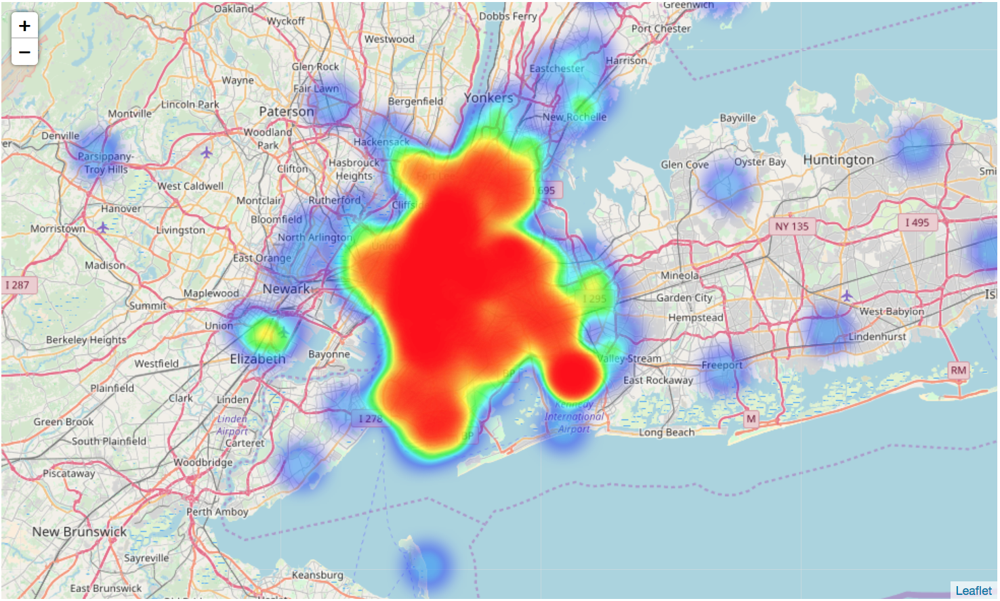

# NYC Taxi Case Study

**MVP:** Get a spark linear regression model, utilizing pipelines, trained and tested on an EMR cluster.

**Experimental Question:** Using New York City Taxi and Limousine Commission (TLC) Trip Record Data can we predict trip fares?

## Process
1. Get data subset from s3 bucket using boto3 (individually)
2. Perform basic EDA locally (individually)
3. Create dataset visualizations (Drew and Sean)
3. Create local spark job (Alex and Amelia):
  - Create DataFrame from s3 source
  - Data cleaning and feature engineering
  - Train and test to prepare for EMR cluster
4. Initiate EMR complete with necessary packages and prep for model (Drew and Sean)
5. Troubleshoot Load our model in and run on full dataset (Amelia and Drew)
6. Presentation (Alex and Sean)

## Data

Data available in csv format from [NYC_gov](http://www.nyc.gov/html/tlc/html/about/trip_record_data.shtml) and "conveniently" uploaded to a s3 bucket on AWS.

**Database size:** 45 GB
**S3 Amazon resource name:** arn:aws:s3:::nyc-tlc

**Description:**
The yellow and green taxi trip records include fields capturing pick-up and drop-off dates/times, pick-up and drop-off locations, trip distances, itemized fares, rate types, payment types, and driver-reported passenger counts. The data used in the datasets were collected and provided to the NYC Taxi and Limousine Commission (TLC) by technology providers authorized under the Taxicab & Livery Passenger Enhancement Programs (TPEP/LPEP).

## EDA
- Cab types
    - Yellow Cab
        - lots of features (19)
        - well populated
    - Green Cab
        - similar number of features to yellow cab
        - **mostly nulls**
    - YeFHV
        - only 3 features availables (3)
- Inconsistencies between years
    - Payment_type
        - 2012: encoded as strings (ex CRD)
        - 2015: encoded as integer IDs (ex 1)
    - Headers
        - 2012: pickup_datetime
        - 2015: tpep_pickup_datetime

**How we decided what question to answer**
- During our EDA we decided to predict total price to preserve as many features as possible to keep our model as adaptable as possible to future iterations if other questions needed to be answered.

## Feature Engineering

[Code_Link][######.py]

- Created trip duration feature from pickup and dropoff times
- Split datetime feature of **pickup time** into component parts
    - Year
    - Month
    - Day of Year (1-365)
    - Day of Month (1-31)
    - Day of Week (1-7)
    - Hour
    - Minute
- One Hot Encoded Categorical Variables
    - Month
    - Dayofweek - Anticipated differences between weekday and weekend rates
    - RateCodeID - Indicator for airport ride, custom fare
    - Payment_type - total amount includes tip for credit card payments, excludes tip for cash payments
    - Note: Did not one hot encode
        - Year because staying within one year for now
        - Day of Year, or Day of Month to avoid adding 400 columns

## Local Model

## Initial Results (Small Data)

Model: **Linear Regression**
- Set the stage
    - Local machine
    - Limit to 10,000 rows of data
    - Default parameters, no regularization
- Results
    - Train RMSE: 5.15
    - Test RMSE: 3.79

prediction | fare_amount
----------|-----------
11.41|       11.0
8.44|        8.0
13.68|       12.5

## Cloud Model

## Final Results (Big Data)

_Model: **Linear Regression**_
  - EMR Cluster
  - Default parameters, no regularization
- Results
  - Train RMSE: 5.15
  - Test RMSE: 3.79

prediction | fare_amount
----------|-----------
11.41|       11.0
8.44|        8.0
13.68|       12.5

**UODATE ABOVE**

# Questions Answered

2. How you organized yourselves as a team
  - First we all created individual Jupyspark notebooks to perform basic EDA
  - Alex and Amelia: Created a local spark model
  - Sean and Drew: Created visualizations and booted up the EMR Cluster on the AWS mainframe
3. How you accessed the data
  - We accessed the data by reading from s3 bucket
6. Things learned along the way
  - The devil is in the details! Or maybe the details are the devil...

## Team Responsibilities

Alex and Amelia:
- local spark model
- feature engineering and pipeline
  - datetime objects to trip pickup time and drop off time to trip time
  - data cleaning by casting and dropping empty rows
  - pipeline for linear regression
  - fit
  - created script to read data from s3 and create spark DataFrame

Sean and Drew:
- Visualizations
- EMR instance
    - with launch_cluster.sh and modified bootstrap.sh to install the following on cluster:
- installed:
    - anaconda
    - git (to get scripts created locally)
    - boto3
    - pyspark
- push scripts up to get then clone down to EMR instance
- got EMR ready to run scripts
